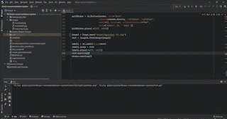

# Emotion based Music Recommender System😁😥🥰😫.

## 💥Contributors :

   * Shreyas.P.J , github: shreyaspj20

   * Utsav Pati ,github: Utsavpati
 
# 💥ABSTRACT :

* Song recommendations have existed for a long time, but in majority of the scenarios the recommendation is determined after learning the user preferences over a period of time, like looking at his past song preferences, time he listens to the music etc. 
* In this paper we propose a new approach to song recommendation, where in the mood of a person is determined from his picture and based on the mood predicted song recommendations are made that best suit the mood predicted.

# 💥DESCRIPTION :

* We first process the image of the user taken as an input with the help of a python library for Computer Vision called 'OpenCV'. This captured image is then made available for the CNN in combination with DNN to make a prediction whether the current mood of the user is 'Happy' or 'Sad'.
* The second part is the usage of Unsupervised Machine Learning techniques for clustering songs.The songs are clustered as either of the two classes-'VERY ENTERTAINING'(class 0) and 'RELAXED'(class 1) using the popular K-means algorithm. Then the recommendation is made in order of the current popularity of the respective songs.
* We have an unique story in the way we recommend the songs for each mood, for example when other sites recommend sad songs when a person is sad or feeling bad, we recommend users with songs which will cheer them up('VERY ENTERTAINING') and 'RELAXING' songs when they are 'HAPPY'.
* The code to train the neural network can be found in the 'Emotion_detector_version2' iPython notebook. If anyone wants to modify the network to suit their particular needs or feel it is necessary to tweak the network they can do so by making changes to the code present there. The model created is saved as 'final_model.h5'

# 💥DATA :
 
 * The data we have used here is from https://www.kaggle.com/yamaerenay/spotify-dataset-19212020-160k-tracks.
 * The file contains more than 160,000 songs collected from Spotify Web API, and also you can find data grouped by artist, year, or genre in the data section.
 * It has features like acousticness, energy, loudness and danceability which make the clustering algorithm work more effectively.
 
 
# 💥LIBRARIES USED :
  * OpenCV.
  * Tensorflow and Keras.
  * Sklearn.
  * LightGBM.
  * Spotipy.
  * Tkinter.
  * Pillow.

Alternatively, click on the link below to the video.

https://youtu.be/F21sr08tg98

# 💥HOW TO USE :

   * This application can be used by executing the run.py file which then opens up a GUI asking the user to enter the name of the artist.
   * This will then collect required albums from the API and then will open up your WebCam .
   * Just click 'q' button on the keyboard to stop capturing the image and the GUI will lead you through. 
   * Clicking on print button will make the recommendations ready for you. 
   * Enjoy the ride😊😊

